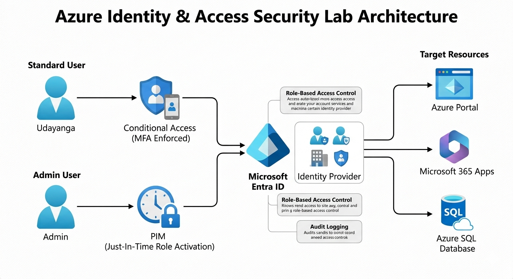

  
  
  
  

 

  
  
  

<h1 align="center">🔐 Azure Privileged Identity Management (PIM) & IAM Hardening Lab</h1>

Enterprise Identity Governance using Microsoft Entra ID  
Aligned with AZ-500 – Identity & Access Domain

---

## 🎯 Lab Objective

This lab demonstrates secure identity and privileged access governance using:

✔ Role eligibility  
✔ Permanent eligible settings  
✔ Just-In-Time (JIT) activation with justification  
✔ Audit and activity tracking  

By enforcing least privilege and just-in-time access, this configuration strengthens identity security in Microsoft Entra ID (Azure AD).

---

## 🏗️ Architecture Overview

  
   <em>Figure 1 — PIM architecture showing eligible role assignment and JIT activation in Microsoft Entra ID.</em>

This diagram illustrates:

- Users created in Microsoft Entra ID  
- Eligible role assignments via PIM  
- Activation workflow requiring justification  
- Privileged role elevation to Active status  
- Audit logging for compliance

---

## 🖼️ Lab Output: Screenshots & Evidence

---

### 1️⃣ Creating Entra ID Users

  
   <em>Figure 2 — Internal users created in Microsoft Entra ID.</em>

Users were created inside the tenant to simulate organizational identities.

---

### 2️⃣ Eligible Role Assignment (Permanent Eligible)

  
   <em>Figure 3 — Setting User Administrator role as Eligible (Permanent eligible option enabled).</em>

Key settings:
✔ Role: User Administrator  
✔ Assignment Type: Eligible  
✔ Permanent Eligible: Yes

---

### 3️⃣ JIT Role Activation with Justification

  
   <em>Figure 4 — Activating privileged role with justification requirement.</em>

This ensures that privileged access is justified, audit-ready, and time-limited.

---

## 📋 Step-by-Step Implementation

1. Created test user accounts in Microsoft Entra ID  
2. Opened Privileged Identity Management → Microsoft Entra roles  
3. Assigned **User Administrator** role as Eligible  
4. Enabled “Permanent eligible” on the assignment  
5. Defined start & end dates  
6. Activated role with justification  
7. Verified assignment under Activity Details

---

## 🔐 Security Concepts Demonstrated

✔ Least Privilege Access  
✔ Just-In-Time (JIT) Elevation  
✔ Eligible vs Active Role States  
✔ Audit & Accountability  
✔ Identity Governance & Compliance

---

## 🧠 Key Learnings

- Eligible assignments provide controlled access without standing privileges  
- Justification and logging support compliance requirements  
- Permanent eligible assignments simplify repeated admin access
- PIM encourages Zero Trust identity practices

---

## 🎓 AZ-500 Certification Relevance

This lab supports these AZ-500 objectives:

✔ Implement identity governance  
✔ Manage privileged access  
✔ Monitor role activations  
✔ Configure PIM for least privilege  

---

## 🏛 Enterprise Security Value

In real-world environments, uncontrolled admin access is a serious risk factor for:

⚠ Insider threats  
⚠ Account takeover attacks  
⚠ Security misconfigurations  
⚠ Compliance failures

Implementing PIM with just-in-time activation reduces risk and improves governance.

---

## 👨‍💻 About the Author

**Amal Udayanga Basnayake**  
Cloud Security | Azure Security Engineer | Identity & Access Governance

🔗 LinkedIn: https://www.linkedin.com/in/amal-udayanga-basnayake  
🔗 GitHub: https://github.com/AmalUBasnayake  

⭐ If this lab helped your AZ-500 prep, consider giving the repository a star!

